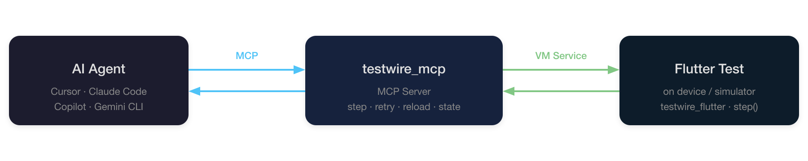

# Testwire

[](https://pub.dev/packages/testwire_flutter)
[](https://pub.dev/packages/testwire_mcp)

Step-based integration test runner for Flutter, controlled by an AI agent
through MCP (Model Context Protocol).

Testwire lets an AI agent **run, observe, debug, and modify** Flutter
integration tests in real time — stepping through actions one by one,
inspecting results, fixing failures via hot reload, and retrying steps without
restarting the test.

<p align="center">
  
</p>

## Why?

Without Testwire, an AI agent's workflow with Flutter integration tests looks
like this: write test → `flutter test` → wait for build and deploy → read
a wall of logs → fix → **restart everything from scratch**. Each cycle burns
minutes on rebuild and wastes tokens on re-reading the same verbose output.

Testwire changes this:

- **No restarts.** Fix a failing step, hot-reload, retry — without rebuilding
  or redeploying the app.
- **Structured feedback.** Instead of parsing 200 lines of logs, the agent gets
  a clean status per step: what passed, what failed, and why.
- **Less tokens.** Each interaction returns a few lines, not the entire test
  output. No repeated context on every retry cycle.
- **Works without the agent.** The same test runs as a normal integration test
  in CI when `AGENT_MODE` is not set.

## Packages

| Package | Version | Description |
|---------|---------|-------------|
| [`testwire`](packages/testwire/) | [](https://pub.dev/packages/testwire) | Core library (pure Dart). Provides `step()`, `TestSession`, VM service extensions. |
| [`testwire_flutter`](packages/testwire_flutter/) | [](https://pub.dev/packages/testwire_flutter) | Flutter wrapper. Provides `TestwireTest` (class-based, hot-reload safe) and `testwireTest()` (function-based, simpler). |
| [`testwire_protocol`](packages/testwire_protocol/) | [](https://pub.dev/packages/testwire_protocol) | Shared protocol definitions — extension names, response formats. |
| [`testwire_mcp`](packages/testwire_mcp/) | [](https://pub.dev/packages/testwire_mcp) | MCP server that bridges AI agents to the running test process. |
| [`example`](example/) | — | Example Flutter app with demo integration tests. |

## Which packages do I need?

**For writing tests** (most users):
- Add `testwire_flutter` to your app's `dev_dependencies` — it re-exports
  everything you need (`testwire` and `testwire_protocol` are pulled in
  automatically).

**For running the MCP server** (connects your AI agent to the test):
- `dart pub global activate testwire_mcp`

That's it — two packages: `testwire_flutter` in your project +
`testwire_mcp` globally.

## How it works

<p align="center">
  
</p>

1. **`flutter run`** launches the integration test on a device or simulator
   with `--dart-define=AGENT_MODE=true`.
2. The test registers VM service extensions and waits for the agent.
3. The **MCP server** (`testwire_mcp`) connects to the VM service and exposes
   tools: `step_forward`, `run_remaining`, `retry_step`, `get_test_state`,
   `hot_reload_testwire_test`, `hot_restart_testwire_test`, `screenshot`,
   `disconnect`.
4. The **AI agent** calls these tools to control execution step-by-step.

### Key capabilities

- **Step-by-step execution** — run one step at a time or all at once.
- **Hot reload** — edit test code (fix bugs, add steps) and hot-reload without
  restarting. Already-completed steps are skipped automatically.
- **Retry** — retry a failed step after fixing the code.
- **Graceful disconnect** — when the agent disconnects, remaining steps run
  automatically and the app process terminates.

## Quick start

### Prerequisites

- Flutter SDK (3.10+)
- iOS Simulator, Android emulator, or a physical device
- Any MCP client (Cursor, Windsurf, Claude Desktop, etc.)

### 1. Install the MCP server

Globally:

```sh
dart pub global activate testwire_mcp
```

Or as a project dev dependency:

```sh
dart pub add dev:testwire_mcp
```

### 2. Configure your MCP client

> The examples below use the global command `testwire_mcp`. If you installed
> it as a dev dependency, replace it with `dart run testwire_mcp`.

#### Cursor

[](cursor://anysphere.cursor-deeplink/mcp/install?name=testwire&config=eyJjb21tYW5kIjoidGVzdHdpcmVfbWNwIn0=)

Or manually add to `.cursor/mcp.json`:

```json
{
  "mcpServers": {
    "testwire": {
      "command": "testwire_mcp"
    }
  }
}
```

#### Claude Code

```sh
claude mcp add --transport stdio testwire -- testwire_mcp
```

#### Gemini CLI

Add to `~/.gemini/settings.json`:

```json
{
  "mcpServers": {
    "testwire": {
      "command": "testwire_mcp"
    }
  }
}
```

#### Copilot

Add to `mcp.json`:

```json
{
  "servers": {
    "testwire": {
      "command": "testwire_mcp"
    }
  }
}
```

### 3. Write a test

```dart
import 'package:flutter/material.dart';
import 'package:flutter_test/flutter_test.dart';
import 'package:testwire_flutter/testwire_flutter.dart';
import 'package:integration_test/integration_test.dart';
import 'package:testwire/testwire.dart';
import 'package:my_app/main.dart' as app;

class MyTest extends TestwireTest {
  MyTest()
      : super(
          'My test',
          setUp: (tester) async {
            app.main();
            await tester.pumpAndSettle();
          },
        );

  @override
  Future<void> body(WidgetTester tester) async {
    await step(
      description: 'Tap the button',
      context: 'Tap the main action button.',
      action: () async {
        await tester.tap(find.byKey(const Key('action_button')));
        await tester.pumpAndSettle();
      },
    );

    await step(
      description: 'Verify result',
      context: 'Check that the result text is displayed.',
      action: () async {
        expect(find.text('Done!'), findsOneWidget);
      },
    );
  }
}

void main() {
  IntegrationTestWidgetsFlutterBinding.ensureInitialized();
  registerTestwireExtensions();
  MyTest().run();
}
```

### 4. Launch the test

```sh
cd example
flutter run \
  --dart-define=AGENT_MODE=true \
  -d <device_id> \
  integration_test/app_test.dart
```

The console will print a VM Service URI. The agent uses it to connect.

### 5. Agent takes over

The agent connects via the `connect` MCP tool, then drives the test with
`step_forward`, `run_remaining`, `get_test_state`, etc.

## Example demos

The [`example`](example) directory includes ready-to-run
demo scenarios that showcase bug-fixing and incremental development via hot reload.

## Without agent mode

When `AGENT_MODE` is not set (or `false`), all `step()` calls execute
immediately without pausing — the test runs like a normal integration test.
This means the same test file works for both agent-controlled and CI
environments.

## Roadmap

- **`testwire_device`** — a standalone Dart package for controlling the
  device/emulator from the host machine via `adb` (Android) and
  `xcrun simctl` (iOS Simulator). Permissions (grant/revoke/reset), system
  settings, deep links, and more — without native code in the app and without
  changing how tests are launched. Works as a library (from tests), as a CLI
  (from CI scripts), and as MCP tools (from AI agents).
  See [proposal](docs/testwire_device_proposal.md).
